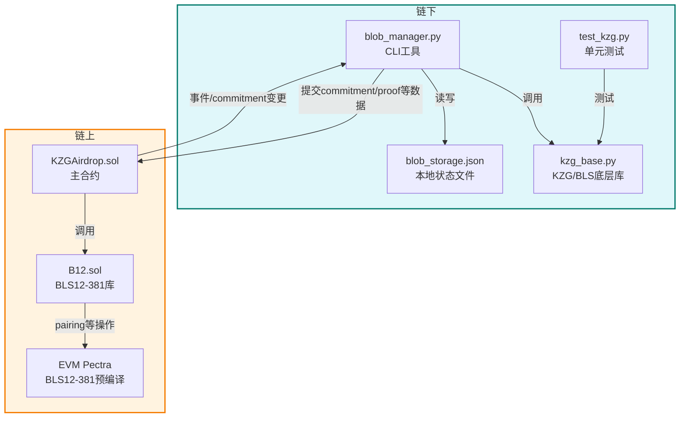

# KZG Airdrop System

一个基于 BLS12-381 与 KZG 承诺的链上 Airdrop 系统，结合链下 blob 存储与链上 commitment 校验，适配 EVM 的 Pectra 升级（包
含 BLS 预编译）。当前链下尚未实现链上事件监听模块，因此 链上发起的交易需手动通过 blob_manager 同步链下数据库。

## 📁 项目结构

```
├── blob_manager.py           # 链下 blob 存储与更新 CLI 工具
├── kzg_base.py               # KZG 核心函数（点乘、多项式求值等）
├── test_kzg.py               # KZG 的 Python 单元测试
├── src/
│   ├── B12.sol               # BLS12-381 G1/G2/Pairing 操作库
│   └── KZGAirdrop.sol        # 主合约，支持 Airdrop 和 Commitment 验证
├── test/
│   ├── Airdrop.t.sol         # 合约逻辑单元测试
│   └── BLSbase.t.sol         # G1/G2 相关基础测试
```

---

## 🗂️ 系统架构图

本系统采用链下（Python 工具）与链上（Solidity 合约）协作的架构，数据流和组件关系如下：



**说明：**
- 链下部分负责用户管理、blob 状态更新、KZG 承诺/证明生成与本地存储。
- 链上部分负责 commitment 管理、proof 验证、空投分发等。
- 链下通过 CLI 工具生成数据并提交到链上，链上变更需手动同步回链下。

---

## 🔧 安装依赖

### Python（链下部分）

```bash
pip install -r requirements.txt
```

依赖包含 `py_ecc`、`typer`、`web3` 等。

### Solidity（链上部分）

使用 Foundry 工具链：

```bash
forge install
```

如未安装 Foundry，请参考：https://book.getfoundry.sh/

## 🚀 blob_manager 使用说明

### 初始化（Init）

#### 命令格式

```bash
python3 blob_manager.py init <user1>:<address1>:<balance1> <user2>:<address2>:<balance2> ...
```

#### 功能说明

- 根据命令行传入的用户标识、地址和初始余额，初始化对应用户的 Blob 数据。
- 为后续链下更新和链上交互准备数据。

#### 参数说明

- `<user>`：用户标识（任意字符串，用于区分用户）。
- `<address>`：用户的以太坊地址（必须符合地址格式）。
- `<balance>`：用户的初始余额（整数）。

#### 示例

```bash
python3 blob_manager.py init user1:0xf39Fd6e51aad88F6F4ce6aB8827279cffFb92266:100 user2:0x70997970C51812dc3A010C7d01b50e0d17dc79C8:200
```

#### 执行结果

- 初始化 `user1` 和 `user2` 两个用户，分别赋予余额 100 和 200。
- 计算并保存用户的 Blob 及对应的 proof。
- 输出初始化过程中的日志信息。

#### 注意事项

- 请确保地址格式正确，余额为非负整数。
- 仅在首次部署或需要重置数据时执行此命令。

### 添加新用户（AddUsers）

#### 命令格式

```bash
python3 blob_manager.py addusers <user3>:<address3>:<balance3> <user4>:<address4>:<balance4> ...
```

#### 功能说明

- 向已有的 Blob 数据库中添加新的用户及其初始余额。
- 为新用户生成对应的 Blob 并写入本地存储。
- 不影响已有用户的数据。

#### 参数说明

- `<user>`：新用户标识（任意字符串）。
- `<address>`：新用户的以太坊地址。
- `<balance>`：新用户的初始余额（整数）。

#### 示例

```bash
python3 blob_manager.py addusers user3:0x3C44CdDdB6a900fa2b585dd299e03d12FA4293BC:300 user4:0x90F79bf6EB2c4f870365E785982E1f101E93b906:400
```

#### 执行结果

- 新增 `user3` 和 `user4` 两个用户，分别赋予余额 300 和 400。
- 生成并保存对应的 Blob 。
- 更新本地用户数据文件，保留所有旧用户信息。

#### 注意事项

- 确保地址格式正确，余额为非负整数。
- 添加操作不会清除或覆盖现有数据。
- 请避免添加重复的用户标识。

### 更新用户余额（Update）

#### 命令格式

```bash
python3 blob_manager.py update -- <user1> <delta1> <user2> <delta2> ...
```

#### 功能说明

- 批量更新多个用户的余额，并同步更新对应的 Blob。
- 每个用户的 `delta` 表示余额的变动，可为正值或负值。
- 更新后自动重新生成 blob 和 commitment。

#### 参数说明

- `<user>`：已存在的用户标识。
- `<delta>`：余额变动值，正数表示增加余额，负数表示减少余额。

#### 示例

```bash
python3 blob_manager.py update -- user1 10 user2 -20 user3 -30 user4 -40
```

#### 执行结果

- user1 的余额增加 10。
- user2 的余额减少 20。
- user3 的余额减少 30。
- user4 的余额减少 40。
- 自动生成新的 blob 和 commitment。
- 所有变更写入本地数据库。

#### 注意事项

- 更新前请确保这些用户已经存在于系统中。
- 更新不会验证用户余额是否为负，请确保链下数据逻辑合理。
- 需要使用 `--` 分隔命令和参数，以避免解析错误。

### 获取用户的 KZG 证明（GetProof）

#### 命令格式

```bash
python3 blob_manager.py getproof <user>
```

#### 功能说明

- 为指定用户计算其当前余额对应的 KZG proof。
- ⚠️ 本命令是 **唯一会实际生成并写入 proof 的操作**，用于确保链下 proof 与最新 blob 状态一致。
- 每次链上提交前，必须通过该命令获取最新 proof，**不要直接从数据库中读取过时的 proof**。

#### 参数说明

- `<user>`：目标用户标识（如 `user1`）。

#### 示例

```bash
python3 blob_manager.py getproof user1
```

#### 执行结果

- 读取 user1 当前 blob 状态。
- 重新计算 commitment、proof，并验证一致性。
- proof 被写入数据库，供后续链上交互使用。

#### 注意事项

- 本命令会更新数据库中的 commitment 和 proof。
- 建议每次链上提交前都调用此命令，确保数据正确。
- 如果用户尚未初始化，请先通过 `init` 或 `addusers` 添加。

## 链上部署合约

### 示例命令

```bash
forge create src/KZGAirdrop.sol:KZGAirdrop \
  --constructor-args "((<X.a>,<X.b>),(<Y.a> <Y.b>))" \
  --private-key <your_deployer_private_key> \
  --rpc-url <your_rpc_url>
```

其中构造函数参数为一个 BLS G1 点，表示初始的 commitment，请从链下工具获取，如：

```bash
python3 blob_manager.py outputcommitment
```

合约部署后当前账户将成为 owner。

## 链上交互说明

本系统合约核心功能主要包括三个方法：

### 1. `updateUserBlob`

该方法由外部调用，用于更新指定用户的 blob 数据（余额等信息）及链上 commitment。

- **参数说明：**

  - `userInfo`：编码后的用户数据，包含用户地址、余额、以及 Lagrange Setup 的坐标信息。
  - `amount`：要扣减的余额。
  - `proof`：KZG proof，用于链上校验。

- **核心逻辑：**

  1. 从 `userInfo` 解码出用户信息和 proof 相关参数。
  2. 计算当前用户数据的哈希 `y`，调用链上 pairing 预编译合约进行 proof 校验，确保数据有效。
  3. 检查余额是否足够，防止透支。
  4. 计算新的哈希值，算出哈希差值 `delta`，并用预存的 lagrange_setup 点更新全局 commitment。
  5. 触发事件 `UserBlobUpdated` 记录旧 commitment 和新 commitment。

- **注意：**  
  目前链下数据库状态与链上状态的同步需人工调用该方法。没有自动监听链上事件的模块，因此链上发起交易后，链下数据库需要手动
  更新，避免数据不一致。

---

### 2. `airdrop`

- **功能：** 由合约拥有者调用，将新的空投 commitment 累加到全局 commitment 上。
- **参数：** `airdropCommitment` 为一个 `B12.G1Point`，代表本次空投的 commitment。
- **逻辑：** 累加并触发 `AirdropUpdated` 事件。

---

### 3. `addUser`

该方法由合约拥有者调用，用于将新用户添加到系统，并根据其 Lagrange Setup 与哈希标识更新全局 commitment。

- **参数说明：**

  - `userInfo`：编码后的用户数据，包含用户地址、余额、以及 Lagrange Setup 的坐标信息。

- **核心逻辑：**

  1. 使用 `abi.decode` 解码用户数据。
  2. 对整个 `userInfo` 字节串执行 `keccak256` 哈希，并模 BLS 模数，得到当前用户对应的 blob value `y`，作为 commitment 加
     权因子。
  3. 构造 G1 点 `lagrangeSetup`。
  4. 执行 G1 加法更新 commitment：  
     `commitment = commitment + y ⋅ lagrangeSetup`。
  5. 触发 `UserBlobUpdated` 事件，记录用户地址、旧 commitment、新 commitment、初始值。

- **注意事项：**
  - 该函数不验证 Lagrange Setup 的合法性，也不校验哈希 `y` 的来源，仅依赖于 `userInfo` 的一致性。

---

### 事件说明

- `UserBlobUpdated(B12.G1Point oldCommitment, B12.G1Point newCommitment, address user, uint256 oldValue, uint256 newValue)`  
  用户数据变更事件，包含更新前后 commitment 及用户余额。

- `AirdropUpdated(B12.G1Point oldCommitment, B12.G1Point newCommitment)`  
  空投 commitment 更新事件。

---

### 额外说明

- 由于当前缺少链上事件监听模块，**链上交易后务必同步链下数据库**，确保 blob 数据一致。
- 合约中使用了 EVM Pectra 升级新增的 BLS12-381 预编译合约，支持高效的 pairing 校验和群操作。

## 🧪 测试流程

### Python 测试（链下逻辑）

```bash
pytest test_kzg.py
```

### Solidity 测试（链上合约）

```bash
forge test
```

## 📌 注意事项

- 本项目依赖 EVM Pectra 升级中新增的 BLS12-381 预编译（0x0b ~ 0x11）。
- 所有哈希需确保链下 encode 逻辑与链上保持一致，避免验证失败。
- blob_manager.py 会自动更新本地 state，包括 commitment、blob、用户哈希等。

## 📄 License

MIT License

## 🙏 鸣谢

- [py_ecc](https://github.com/ethereum/py_ecc)：BLS12-381 实现库
- [ethereum/EIPs](https://github.com/ethereum/EIPs/pull/6147)：BLS12-381 预编译提案
- Foundry 工具链团队
